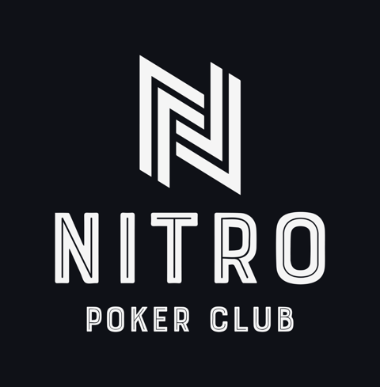

<p align="center">
  
</p>

<h1 align="center">NitroCall</h1>

<p align="center">
  <b>Voz e tela entre amigos. Direto de aparelho para aparelho, criptografado, sem conta.</b><br />
  Para grupos pequenos (2 a 8 pessoas). Grátis, sem anúncios, sem rastreamento, código aberto.
</p>

<p align="center">
  <a href="https://devtraldi.github.io/nitrocall/"><b>▶ Abrir o NitroCall</b></a> ·
  <a href="README.md">English</a>
</p>

---

## Por que isso existe

Um grupo de amigos, o **Nitro Poker Club**, queria só uma coisa: se falar e ver a tela uns dos
outros (o jogo, um vídeo do YouTube com som) sem criar conta, sem instalar nada pesado, sem
pagar assinatura e sem entregar as conversas para uma empresa.

As ferramentas grandes resolvem isso centralizando tudo num servidor delas. O NitroCall
faz o contrário: **os próprios aparelhos dos amigos são a infraestrutura.** A página é um
arquivo estático. Depois que abre, o GitHub sai da história: o áudio e a tela vão direto de
um aparelho para o outro.

Não existe intenção comercial. Não há plano pago, anúncio, coleta de dados nem "versão pro".
O projeto é e vai continuar sendo gratuito e aberto.

## O que ele faz

- 🎙️ **Voz** em Opus 64 kbps com correção de perda e supressão de ruído por IA (RNNoise).
- 🖥️ **Tela em até 1080p30, com o som do PC** (vídeo, jogo, música), com ajuste automático
  de qualidade quando a internet de alguém não aguenta.
- 📱 **Celular:** entra pelo navegador, ouve, fala, vê as telas em tela cheia e pode mostrar a
  **câmera** (traseira ou frontal).
- 🔒 **Criptografia de ponta a ponta** (DTLS-SRTP, obrigatória no WebRTC), com código de
  segurança por pessoa, no estilo do Signal, para conferir que ninguém está no meio.
- 🌉 **Nunca fica sem caminho.** O NitroCall tenta, nesta ordem:
  1. **direto** entre os dois aparelhos;
  2. **ponte por um amigo** da sala, escolhido automaticamente pela melhor conexão;
  3. **TURN**, um servidor de repasse, só quando não há caminho direto nem amigo para fazer a
     ponte. A mídia continua cifrada: o TURN repassa pacotes que não consegue abrir.
- 🎲 **Sem cadastro:** escolha um código de sala, e o app sorteia um nome engraçado para você
  ("Ás de Pijama", "Blefe Sem Wi-Fi"…). Pode trocar.
- 🌎 **Português e inglês.**
- 💻 Também existe como **app para Windows** (Tauri), com bandeja, atalho global para mutar e
  atualização automática. O app e o site entram na mesma sala.

## Como funciona (sem jargão)

```
  Você abre o link ──► o GitHub entrega a página (~2,4 MB, uma vez)
                             │
                             ▼
  Os aparelhos se encontram num "ponto de encontro" público (PeerJS; reserva: Nostr)
                             │
                             ▼
  A chamada vai DIRETO entre os aparelhos (WebRTC)        ← quase sempre
         ou passa por um AMIGO da sala que faz ponte      ← quando dois não se alcançam
         ou passa pelo TURN, cifrada                      ← último recurso
```

Uma chamada de uma hora **não** usa uma hora de servidor nosso. O GitHub só entrega o arquivo;
o custo de banda da chamada fica com os próprios participantes, como numa ligação entre dois
celulares.

## Transparência: o que usamos de terceiros e o que cada um vê

"Sem servidor" quer dizer **sem servidor de mídia e sem servidor nosso guardando dados**. Para
os aparelhos se acharem, o NitroCall usa serviços públicos e gratuitos:

| Serviço | Para quê | O que vê |
|---|---|---|
| GitHub Pages | entregar a página | que alguém abriu o site (como qualquer site) |
| PeerJS (0.peerjs.com) | ponto de encontro: reservar a vaga na sala | um identificador derivado do código da sala (hash), IPs |
| Relays Nostr públicos | ponto de encontro reserva, se o PeerJS cair | mensagens de sinalização cifradas com a chave da sala |
| STUN (Google/Cloudflare) | cada aparelho descobrir o próprio endereço na internet | o seu IP |
| TURN (Cloudflare) + Worker | último recurso de repasse | IPs e pacotes cifrados; **não** consegue ouvir nem ver nada |

O código da sala vai depois do `#` no link de convite e nunca é enviado ao GitHub.

## Limites, com honestidade

- **Pensado para 2 a 8 pessoas.** 9–10 funciona, mas é experimental: quem compartilha a tela
  manda uma cópia para cada pessoa (ou para amigos que redistribuem), e o upload de casa acaba.
- **Celular não compartilha a própria tela pelo navegador.** Nem o Android nem o iPhone
  permitem isso a sites; o NitroCall oferece a câmera no lugar.
- **iPhone em segundo plano:** o iOS corta o microfone de qualquer site quando você troca de
  app. O NitroCall avisa os outros ("saiu da aba") e religa o microfone sozinho quando você volta.
- **O TURN depende de um serviço de terceiros** com cota grátis (1.000 GB/mês). Se um dia ele
  faltar, o NitroCall continua funcionando com direto e ponte por amigo.
- Melhor no **Chrome ou no Edge** do computador (são os que mandam o som do PC junto com a
  tela).

## Feito com Claude: um projeto 100% "vibe coding"

Sendo direto: **este projeto foi escrito em parceria com o [Claude](https://claude.ai), da
Anthropic, usando o [Claude Code](https://docs.claude.com/en/docs/claude-code/overview) (CLI).**
Eu defini o que queria, testei com os amigos de verdade, reclamei do que estava ruim e decidi
os rumos; o Claude escreveu praticamente todo o código, os testes automatizados e a
documentação, e ajudou a investigar cada problema (NAT, codecs, GPU, qualidade de tela).

O NitroCall faz parte do meu **roteiro de aprendizado** das ferramentas da Anthropic: Claude
Code, agentes, testes guiados por IA, e como construir algo real e útil com elas. Se você está
aprendendo o mesmo, fique à vontade para ler o histórico, copiar ideias e abrir issues.

## Para quem quer rodar ou modificar

O código-fonte, os testes (ponta a ponta com vários navegadores, laboratório de qualidade de
imagem e emulador de rede) e as instruções de build estão em [`app/`](app/). O Worker de
credenciais TURN (opcional) está em [`app/cloudflare/turn-worker/`](app/cloudflare/turn-worker/).

## Licença

[MIT](LICENSE). Use, copie, modifique e compartilhe.

---

<sub>Nitro Poker Club · feito entre amigos, para amigos.</sub>
